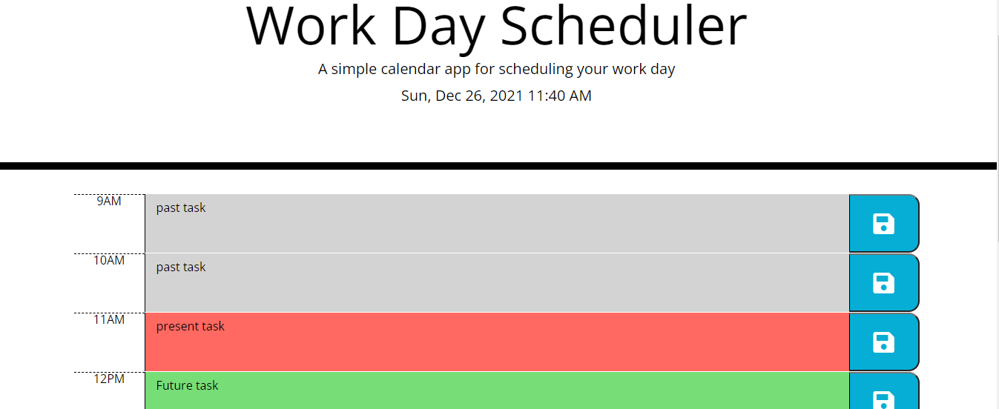

# Daily-calendar-app
## The Repository
This repository contains a Work day planner that allows you to save events for each hour of the day. The app runs in the browser and feature dynamically updated HTML and CSS powered by jQuery
### The Purpose
The planner application makes it easier for employees with a busy schedule to add important events so that they can manage thier time effcetively.This app runs in the browser, and features dynamically updated HTML and CSS powered by JavaScript code. It has a clean and polished user interface.

### How it Works
The app runs in the browser and feature dynamically updated HTML and CSS powered by jQuery.It uses the day.js library to work with date and time.
* The current day is displayed at the top of the calendar.
* Calendar presents timeblocks for standard bussiness hours 9am -5pm.
* Each time block is color-coded to indicate whether it is in the past, current or future.
* By clicking on each time block you are able to enter and event
* By clicking on the save button the event is saved in local storage

## Screenshot of deployed page:

## Link to deployed application:

The deployed application [Daily Calendar App](https://robel-codes.github.io/daily-calendar-app/)

